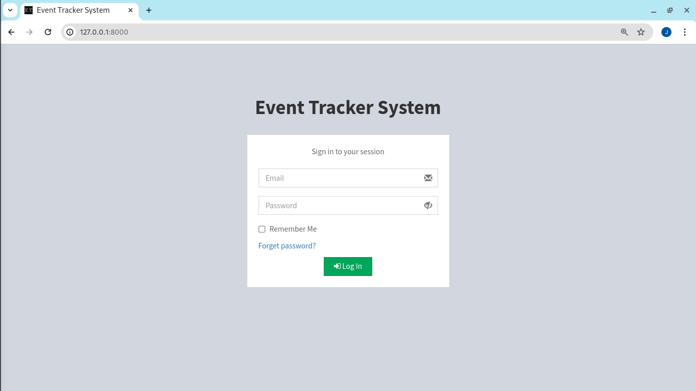
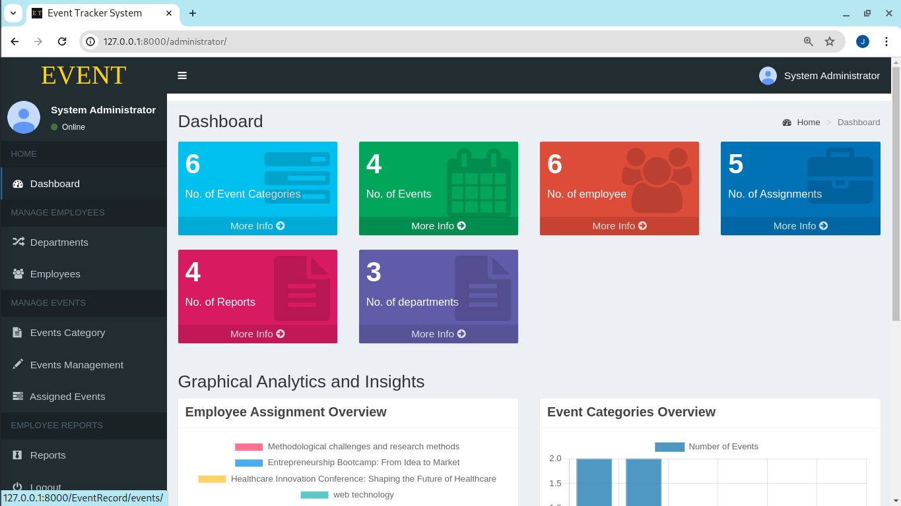
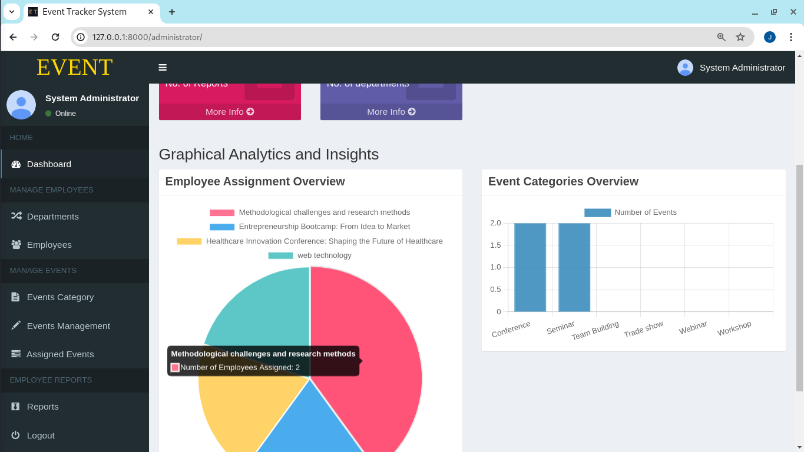
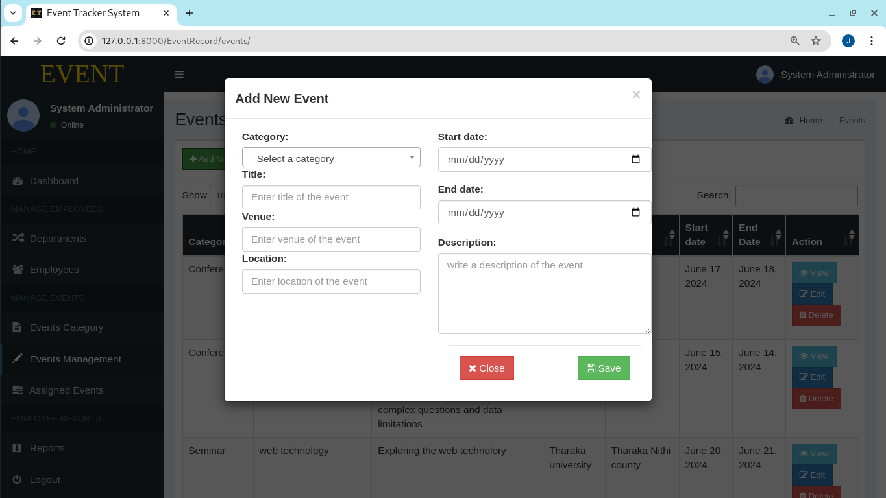
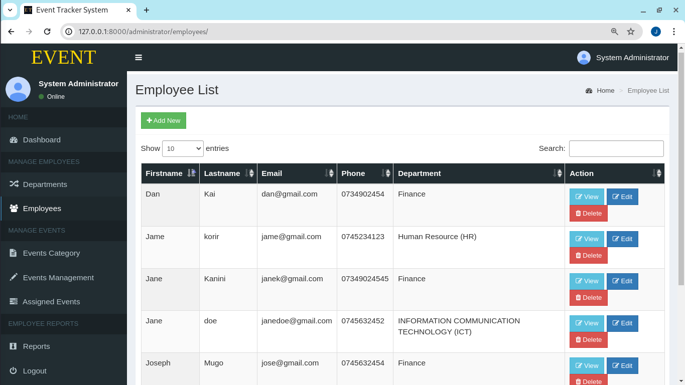
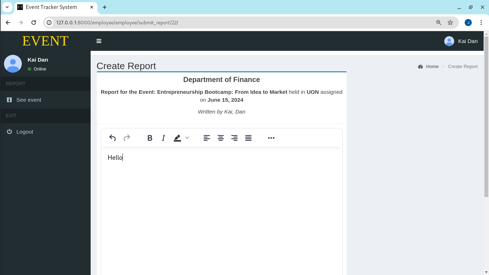
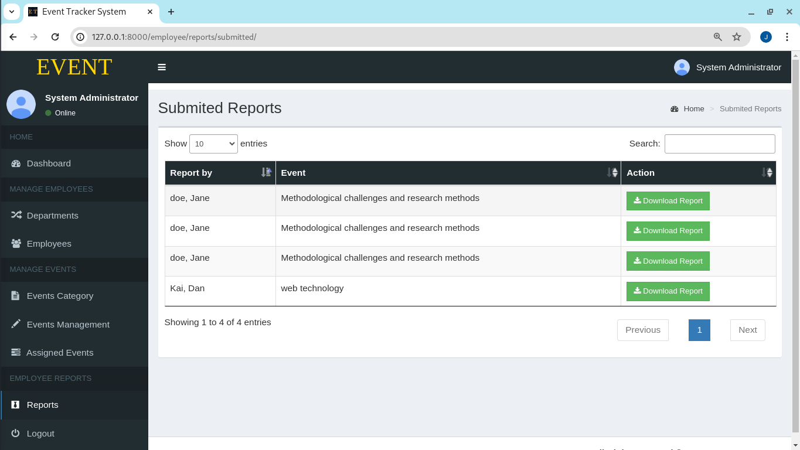
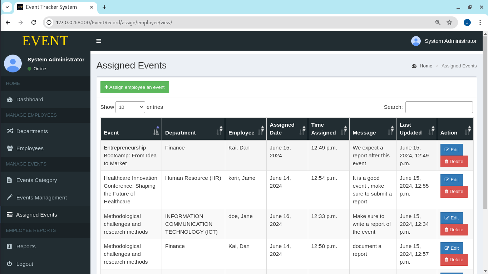

# Hey, WELCOME
# EventTracker

EventTracker is a Django-based application designed to manage events, assignments, and reporting within an organization. This system escapulates the essence of what it does through streamlines event management, events assignment,enhances transparency, accountability, and provides valuable insights through comprehensive reporting and analytics.

## Features

- **User Authentication:** Secure login system for employees.
- **Event Assignment Management:** Create, assign, and manage events.
- **Event Reporting Interface:** Intuitive interface for reporting activities.
- **Multimedia Support:** Employee writting reports can Upload any relevant file partaining the event. 
- **Report Submission:** Through the employee interface the can write and submit their event reports Online.
- **Review Workflow:** Supervisor/administrator can review the submitted event reports
- **Notification System:** Automated notifications for key actions.
  - Login credentials :- when user is created in the system, automated email is sent carrying user password and email.
  - Password reset request :- when user request a password reset ,automate email is sent with instruction.
  - Assignment and changes if any:- whenever a user is assigned an event to attend, user get notified automatically through email.
- **Search and Filtering:** Admin and users can search  and filter options in the tables in the system.
- **Data Security and Privacy:** User data is encrypted not even the admin can know the user personal information such as password.
- **Analytics and Insights:** System offer a graphical interface for various domains for analytics.
- **Mobile Compatibility:** The system is Mobile responsive making accessible on mobile devices.


## Visuals

### Login Page

### Admin Dashboard

### Graphical interface

### Event Assignment

### Employees

### Employee Reporting Interface

### Event Report

### Assigning Event


### Workflow Demonstration


## Installation

### Prerequisites

- Python 3.11.8
- RabbitMQ
- MySQL 

### Steps

1. **Clone the repository:**

    ```bash
    git clone https://github.com/JOSEPH-MUGO/
    ```

3. **Create and activate a virtual environment:**

    ```bash
    python3 -m venv venv
    source venv/bin/activate  # On Window use `venv\Scripts\activate`
    ```
   

4. **Install dependencies:**

    ```bash
    pip install -r requirements.txt
    ```

5. **Configure the database:**
   Update the `DATABASES` setting in `settings.py` with your database credentials.

6. **Run migrations:**

    ```bash
    python manage.py migrate
    ```

7. **Create a superuser:**
 Admin
    ```bash
    python3 manage.py createsuperuser
    ```

8. **Start the development server:**

    ```bash
    python3 manage.py runserver
    ```

## Usage

### User Authentication
-Login to the system as admin first using the superuser credentials.
- New users can be created by the admin through the admin interface.
- Users can log in using their credentials.
### Employee / Users Management
- Authorized personnel can create, manage users account.
- Adding new users to the system
- Updating the user account if need.
- Delete user account in the system.
### Event Assignment Management

- Authorized personnel can Manage event assignment easily such as creating, updating, deleting and assign events to employees/users.
- Event details include Category, Title, date, location, venue, description, and assigned employees.

### Event Reporting Interface

- Employees can report their activities using a simple form.
- Reports can include text and multimedia files partaining the event.

### Multimedia Support

- Users can upload files as part of their reports.

### Report Submission

- Employees submit their reports online.
- Submitted reports are stored in the system for review and download.

### Review and Download Workflow

- Supervisors review submitted reports.
- Feedback can be provided, and reports can be downloaded.

### Notification System

- Notifications are sent for authorization, event assignments and report submissions.

### Search and Filtering

- Users can search and filter events and reports by their preffered fields data.

### Data Security and Privacy

- The system adheres to data security standards to protect sensitive information of the employees.

### Analytics and Insights

- Graphical tabulation of data in some of system domains, for faster analysis and insight.

### Mobile Compatibility

- The system is responsive and accessible on mobile devices.


## Contributing

Thank you for considering contributing to my project! Contributions are welcomed and encouraged.

### How to Contribute

1. **Fork** the repository and clone it locally.
2. **Set Up** your development environment.
3. **Create** a new branch for your feature or bug fix.
4. **Commit** your changes with descriptive messages.
5. **Push** your branch to your fork.
6. **Open** a pull request (PR) to our main repository.
## License

This project is licensed under the MIT License - see the [LICENSE](LICENSE) file for details.

## Acknowledgments

- Thanks to the Django community for their excellent framework.
- Special thanks to the team for their dedication and hard work.
### support
- if you need any assistance concerning the project do not hesitate to call me.
```email
josephithanwa@gmail.com
```
